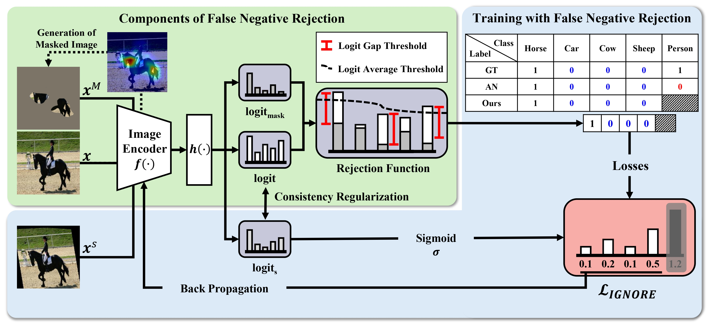

# [ECCV 2024 Poster] IGNORE: Information Gap-based False Negative Loss Rejection for Single Positive Multi-Label Learning

### [Paper](https://www.ecva.net/papers/eccv_2024/papers_ECCV/papers/05081.pdf)

This is the official PyTorch implementation of ECCV 2024 paper (IGNORE: Information Gap-based False Negative Loss Rejection for Single Positive Multi-Label Learning).
> [GyeongRyeol Song](https://github.com/gyeong-ryeol-song?tab=repositories)*, Noo-ri Kim, [Jin-Seop Lee](https://github.com/JINSUBY), and Jee-Hyong Lee
> <br/> Sungkyunkwan University, Suwon, South Korea


### Abstract
Single Positive Multi-Label Learning (SPML) is a method for a scarcely annotated setting, in which each image is assigned only one positive label while the other labels remain unannotated. Most approaches for SPML assume unannotated labels as negatives (“Assumed Negative", AN). However, with this assumption, some positive labels are inevitably regarded as negative (false negative), resulting in model performance degradation. Therefore, identifying false negatives is the most important with AN assumption. Previous approaches identified false negative labels using the model outputs of assumed negative labels. However, models were trained with noisy negative labels, their outputs were not reliable. Therefore, it is necessary to consider effectively utilizing the most reliable information in SPML for identifying false negative labels. In this paper, we propose the Information Gap-based False Negative LOss REjection (IGNORE) method for SPML. We generate the masked image that all parts are removed except for the discriminative area of the single positive label. It is reasonable that when there is no information of an object in the masked image, the model’s logit for that object is low. Based on this intuition, we identify the false negative labels if they have a significant model’s logit gap between the masked image and the original image. Also, by rejecting false negatives in the model training, we can prevent the model from being biased to false negative labels, and build more reliable models. We evaluate our method on four datasets: Pascal VOC 2012, MS COCO, NUSWIDE, and CUB. Compared to previous state-of-the-art methods in SPML, our method outperforms them on most of the datasets.


### Single Positive Annotation Setting
Run generate_observed_labels.py in the preproc directory to obtain single positive annotation for each dataset.

```
python preproc/generate_observed_labels.py --dataset {DATASET}
```

### Environment Setting
```
conda env create --file environment.yml
```

### Usage
Example runs with Q2L model
```
### PASCAL VOC 2012
python main.py --dataset pascal --mode train_q2l --gpu_num 0 --bsize 16 --num_epochs 25 --backbone resnet50 --spbc_weight 0.5 --ignore_weight 1 --reg_weight 0.5 --gap_lambda 0.999 --avg_lambda 0.999
```

Example runs with ResNet-50 model:
```
### PASCAL VOC 2012
python main.py --dataset pascal --mode train_resnet --gpu_num 0 --bsize 16 --num_epochs 25 --spbc_weight 0.1 --ignore_weight 1 --reg_weight 0.5 --gap_lambda 0.999 --avg_lambda 0.999
```

## Bibtex
If you find our work useful, please consider citing and star:
```BibTeX
@inproceedings{song2025ignore,
  title={IGNORE: Information Gap-Based False Negative Loss Rejection for Single Positive Multi-Label Learning},
  author={Song, GyeongRyeol and Kim, Noo-ri and Lee, Jin-Seop and Lee, Jee-Hyong},
  booktitle={European Conference on Computer Vision},
  pages={472--488},
  year={2025},
  organization={Springer}
}
```

### Acknowledgement

Our code is built on the following these repositories. We greatly appreciate their work.
* [Large Loss Matters in Weakly Supervised Multi-Label Classification](https://github.com/snucml/LargeLossMatters)
* [Bridging the Gap between Model Explanations in Partially Annotated Multi-label Classification ](https://github.com/youngwk/BridgeGapExplanationPAMC)
* [Query2Label: A Simple Transformer Way to Multi-Label Classification](https://github.com/SlongLiu/query2labels)